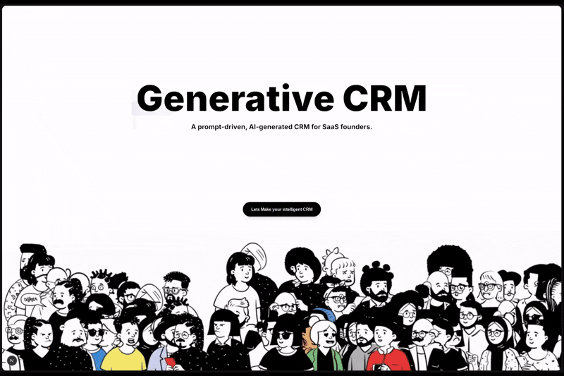

<div align="center">

# 🚀 Generative CRM

### A prompt-driven, AI-generated CRM for SaaS founders.

[](https://nextjs.org/)
[](https://react.dev/)
[](https://www.typescriptlang.org/)
[](https://tailwindcss.com/)
[](LICENSE)

> 🔧 **Built on [Tambo AI Starter Template](https://github.com/tambo-ai/tambo-template)** — The fastest way to build AI-powered apps with Next.js

**Build your entire CRM dashboard just by describing what you need.**

[Live Demo](#) • [Documentation](#documentation) • [Report Bug](issues) • [Request Feature](issues)

</div>

---

## ✨ What is Generative CRM?

Generative CRM is an **AI-powered, prompt-driven CRM** that lets you create dashboards, charts, stats, and data visualizations simply by chatting with an AI. No drag-and-drop builders, no complex configurations — just describe what you want, and watch it appear.



---

## 🎬 See It In Action

### Creating Widgets with Natural Language

*Replace with GIF showing: "Create a revenue chart for the last 6 months"*

### Editing Widgets Through Conversation

*Replace with GIF showing: selecting a widget and asking AI to modify it*

### Multi-Canvas Dashboard Management

*Replace with GIF showing creation and switching between conversation threads/canvases*

---

## 🌟 Features

### 🤖 AI-Powered Widget Generation
- **Natural Language Interface** — Describe what you need in plain English
- **Smart Context Understanding** — The AI understands your data and generates relevant visualizations
- **Widget Editing** — Select any widget and ask the AI to modify, update, or replace it
- **JSON Import** — Generate widgets directly from JSON data structures

### 🔌 Integrations
- **MCP Support** — Connect to Model Context Protocol servers to fetch real-world data
- **Data Connectors** — Import data seamlessly from external sources

### 📊 Rich Widget Library
| Widget Type | Description |
|-------------|-------------|
| 📈 **Charts** | Bar, Line, Pie, Area charts with Recharts |
| 📋 **Stats Cards** | Key metrics with trends and comparisons |
| 📝 **Lists** | Sortable, filterable data lists |
| 🔥 **Heatmap** | Visualize activity density and patterns |
| 🎯 **Custom** | Any component the AI generates |

### 🎨 Beautiful Canvas System
- **Drag & Drop** — Freely position widgets anywhere on the canvas
- **Resize** — Adjust widget sizes to your preference
- **Infinite Canvas** — Pan around with mouse drag (Ctrl+F to center)
- **Persistent Layouts** — Your layouts stay where you put them

### 💬 Conversational Interface
- **Floating Chat Island** — Minimal, always-accessible chat UI
- **Thread History** — Multiple conversation threads, each with its own canvas
- **Voice Input** — Speak your commands with built-in speech-to-text
- **Context-Aware Editing** — Select a widget and chat directly about it

### 🎵 Delightful UX
- **Sound Effects** — WhatsApp-style audio feedback for all interactions
- **Smooth Animations** — Framer Motion powered transitions
- **Theme Support** — Light/Dark mode with one click
- **Responsive Design** — Works on desktop and tablet

---

## 🛠️ Tech Stack

### Core Framework
| Technology | Version | Purpose |
|------------|---------|---------|
| [Next.js](https://nextjs.org/) | 15.5 | React framework with App Router |
| [React](https://react.dev/) | 19 | UI library |
| [TypeScript](https://www.typescriptlang.org/) | 5 | Type safety |

### AI & Chat
| Technology | Purpose |
|------------|---------|
| [Tambo AI](https://tambo.co/) | AI-powered component generation |
| [@tambo-ai/react](https://www.npmjs.com/package/@tambo-ai/react) | React hooks for Tambo |

### UI & Styling
| Technology | Purpose |
|------------|---------|
| [TailwindCSS](https://tailwindcss.com/) | Utility-first CSS |
| [Framer Motion](https://www.framer.com/motion/) | Animations |
| [Radix UI](https://www.radix-ui.com/) | Accessible UI primitives |
| [Lucide React](https://lucide.dev/) | Icon library |

### Data Visualization
| Technology | Purpose |
|------------|---------|
| [Recharts](https://recharts.org/) | Charts and graphs |

### State Management
| Technology | Purpose |
|------------|---------|
| [Zustand](https://zustand-demo.pmnd.rs/) | Lightweight state management |

### Rich Text
| Technology | Purpose |
|------------|---------|
| [Tiptap](https://tiptap.dev/) | Rich text editor for chat input |

---

## 🚀 Getting Started

### Prerequisites

- Node.js 18+ 
- npm, yarn, or pnpm
- A [Tambo AI](https://tambo.co/dashboard) API key (free tier available)

### Installation

1. **Clone the repository**
   ```bash
   git clone https://github.com/iamMD01/intelligent_CRM.git
   cd intelligent_CRM
   ```

2. **Install dependencies**
   ```bash
   npm install
   ```

3. **Set up environment variables**
   ```bash
   # Copy the example env file
   cp example.env.local .env.local
   
   # Add your Tambo API key
   NEXT_PUBLIC_TAMBO_API_KEY=your_api_key_here
   ```

4. **Run the development server**
   ```bash
   npm run dev
   ```

5. **Open [http://localhost:3000](http://localhost:3000)** in your browser

---

## 📖 Documentation

### Project Structure

```
src/
├── app/                    # Next.js App Router pages
│   ├── page.tsx           # Landing page
│   ├── dashboard/         # Main dashboard
│   └── layout.tsx         # Root layout
├── components/
│   ├── layout/
│   │   ├── BentoGrid.tsx  # Canvas widget system
│   │   └── MorphingChat.tsx # Chat interface
│   ├── ui/                # Reusable UI components
│   └── ai-elements/       # AI-specific components
├── lib/
│   ├── sounds.ts          # Sound effects system
│   ├── crm-store.ts       # Zustand store
│   ├── theme-store.ts     # Theme state
│   └── tambo.ts           # Tambo configuration
└── public/
    └── images/            # Static assets
```

### Key Components

#### BentoGrid
The main canvas system that renders and manages widgets:
- Drag & drop positioning
- Resize handles
- Context menu (right-click)
- Widget selection for AI editing

#### MorphingChat
The floating chat interface:
- Pill → Chat → History morphing states
- Thread management
- Voice input support
- Dark/light theme toggle

### Adding Custom Widgets

Register new widget types in `src/lib/tambo.ts`:

```tsx
export const components: TamboComponent[] = [
  {
    name: "MyCustomWidget",
    description: "Description for the AI to understand when to use it",
    component: MyCustomWidget,
    propsSchema: myWidgetSchema,
  },
];
```

### Sound Effects

The app includes a custom Web Audio API sound system:

```tsx
import { sounds } from "@/lib/sounds";

// Available sounds
sounds.create();        // Widget created
sounds.update();        // Widget updated
sounds.delete();        // Widget deleted
sounds.messageSent();   // Message sent (WhatsApp style)
sounds.messageReceived(); // AI response received
sounds.newChat();       // New chat created
sounds.addToChat();     // Widget added to chat context
```

---

## 🎯 Usage Examples

### Creating Charts
```
"Create a bar chart showing monthly revenue from January to June"
"Show me a pie chart of customer segments"
"Generate a line chart of user growth over the last year"
```

### Creating Stats
```
"Show total revenue with 23% growth"
"Create a stat card for active users showing 1,234"
"Display conversion rate at 4.5%"
```

### Editing Widgets
1. Click on any widget to select it
2. The chat placeholder changes to "Edit this widget..."
3. Say what you want to change:
   - "Change this to a line chart"
   - "Add a title: Monthly Revenue"
   - "Update the colors to blue and purple"

---

## ⌨️ Keyboard Shortcuts

| Shortcut | Action |
|----------|--------|
| `Ctrl + F` | Center canvas view |
| `Delete` | Delete hovered thread (in history view) |
| `Enter` | Send message |
| `Shift + Enter` | New line in message |

---

## 🎨 Customization

### Themes
Toggle between light and dark mode using the button in the chat interface. The theme persists across sessions.

### Colors
Modify the color scheme in `globals.css` and `tailwind.config.ts`.

### Sound Effects
Enable/disable sounds programmatically:
```tsx
import { setSoundEnabled } from "@/lib/sounds";
setSoundEnabled(false); // Mute all sounds
```

---

## 🤝 Contributing

Contributions are welcome! Please feel free to submit a Pull Request.

1. Fork the repository
2. Create your feature branch (`git checkout -b feature/AmazingFeature`)
3. Commit your changes (`git commit -m 'Add some AmazingFeature'`)
4. Push to the branch (`git push origin feature/AmazingFeature`)
5. Open a Pull Request

---

## 📄 License

This project is licensed under the MIT License - see the [LICENSE](LICENSE) file for details.

---

## 🙏 Acknowledgments

- [Tambo AI](https://tambo.co/) for the incredible AI SDK
- [Vercel](https://vercel.com/) for Next.js and hosting
- [Radix UI](https://www.radix-ui.com/) for accessible component primitives
- [Recharts](https://recharts.org/) for beautiful charts

---

<div align="center">

**Built with ❤️ by [iamMD01](https://github.com/iamMD01)**

⭐ Star this repo if you find it useful!

</div>
